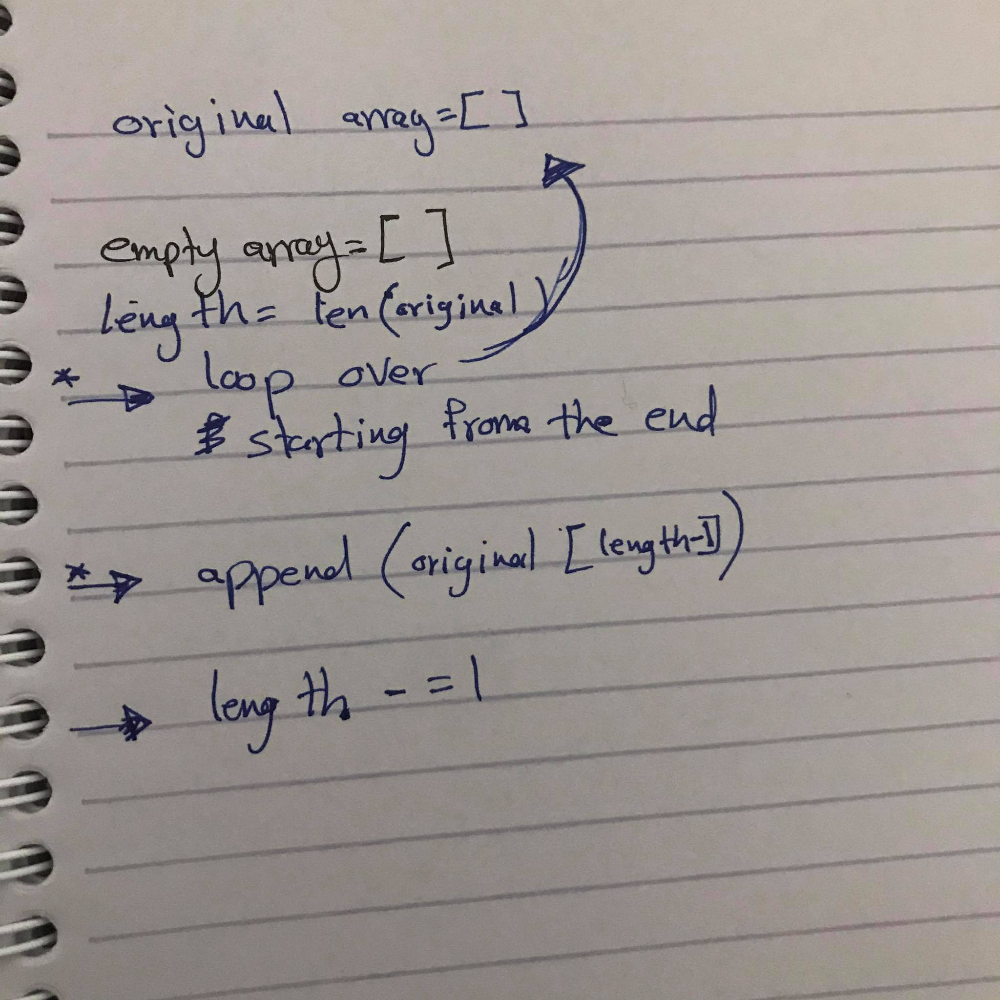

# Challenge
in this challenge you will write function that take an argument and its must return it as reverse and your and your function must be as clean as possible.

**************
to reverse an array; you can declare an empty array or list.
then you can loop over the original array (length of the array) with -1 in order to start from the end.
after that you can keep decreasing the value (-1).

